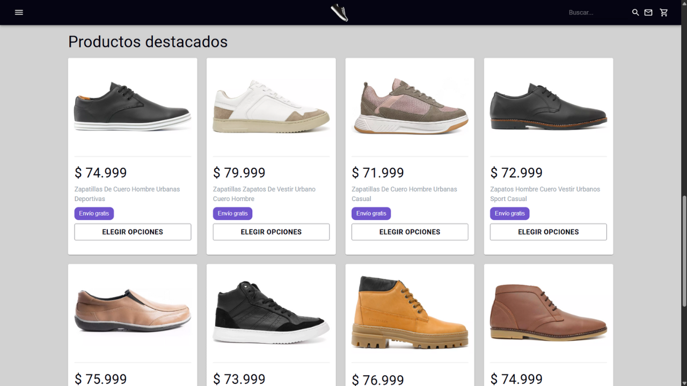
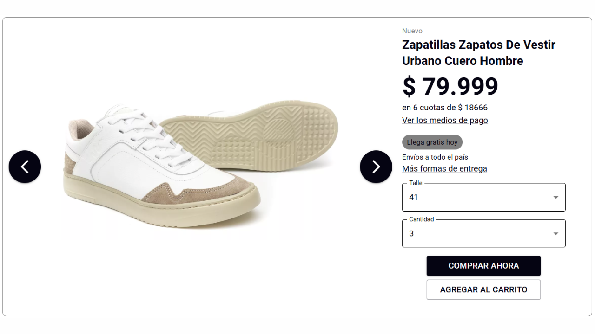
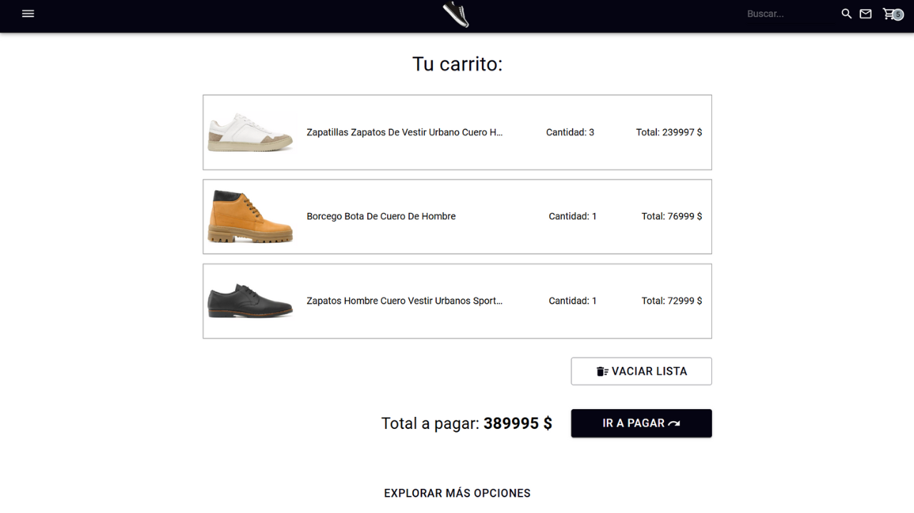

# 👟 Sneaker Market

¡Bienvenido a **Sneaker Market**!  

👉 **[Ver la demo en producción](https://sneakermarket.netlify.app/)**
Una aplicación web pensada como una tienda online de zapatillas, donde podés explorar distintos modelos, agregarlos al carrito y simular una compra.

## 📖 Descripción
Este proyecto fue desarrollado en **JavaScript con React** para el frontend, y utiliza herramientas modernas del ecosistema React.  
Es una app sencilla pero funcional, creada para practicar conceptos clave de desarrollo frontend, como componentes reutilizables, manejo de estado y rutas.

## 🛠️ Tecnologías utilizadas
- React
- React Router
- Material UI
- JavaScript
- HTML & CSS

## 📷 Capturas de pantalla
A continuación, algunas imágenes del sitio en funcionamiento:






## 🚀 Cómo ejecutar el proyecto
1. Clonar este repositorio:
   ```sh
   git clone https://github.com/Gherex/SneakerMarket.git
   ```
2. Instalar las dependencias: npm install
3. Ejecutar la app en modo desarrollo: npm run dev
4. Abrir en el navegador: http://localhost:5173

## 📁 Estructura del proyecto
El proyecto tiene una estructura simple, con rutas para:

- Inicio
- Productos
- Detalle de cada zapatilla
- Carrito de compras

## ✍️ Autor
**Germán Lagger**  
- [GitHub](https://github.com/Gherex)
- [LinkedIn](https://www.linkedin.com/in/germanlagger/)
